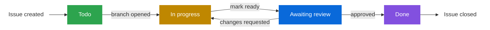

# Contributing Guidelines
Welcome to Playlink. To maintain a high-quality codebase and efficient development cycle, all contributors must adhere to the following standards.
## 🏃 Kanban Workflow
We use a **Kanban-driven** development process. No code should be written without a corresponding issue.



1.  **Identify a Task:** Pick an issue from the [Kanban Board](https://github.com/orgs/ioad-modul-sumatywny-26/projects/2) or create a new one.
2.  **Assign Yourself:** Move the issue to the **In Progress** column and assign yourself.
3.  **Implement:** Create a feature branch and implement the changes.
4.  **Review:** Submit a Pull Request — this automatically moves the issue to **Awaiting Review**.
5.  **Merge:** Once approved and CI passes, merge via **Squash and Merge** — this automatically moves the issue to **Done** and closes it.

---
## 🌿 Branching Strategy
Branches must be named using the following prefixes:
-   `feat/`: New features (e.g., `feat/auth-system`)
-   `fix/`: Bug fixes (e.g., `fix/login-error`)
-   `docs/`: Documentation changes
-   `chore/`: Maintenance tasks, dependencies, etc.
-   `ci/`: Changes to CI/CD pipelines

---
## 📝 Commit Conventions
We use a simplified version of Conventional Commits to keep our history readable.
**Format:** `<type>: <description>`
### Common Types:
-   `feat`: A new feature
-   `fix`: A bug fix
-   `docs`: Documentation changes
-   `refactor`: Code change that neither fixes a bug nor adds a feature
-   `test`: Adding or correcting tests
-   `chore`: Maintenance tasks (dependencies, build process, etc.)

**Example:**
`feat: implement BIP39 signature verification`

---
## 🚀 Pull Request Standards
-   **Link the Issue:** Always include `Closes #<issue_number>` in the PR description.
-   **Atomic Changes:** Keep PRs focused on a single task. Small, frequent PRs are easier to review.
-   **CI Validation:** Ensure all linting and tests pass before requesting a review.
-   **Approvals:** All PRs require **at least one** approving review from a teammate. *(Branch protection not yet configured — enforced by convention for now.)*
-   **Merging:** Use **Squash and Merge** to maintain a clean linear history on `main`.

---
## 🛠 Quality Control
-   **Backend:** `uv run pytest` for the test suite. After changing any SQLModel schema, generate a migration with `uv run alembic revision --autogenerate -m "..."` and commit it alongside the model change.
-   **Frontend:** `bun run check` (svelte-check + TypeScript), `bun run lint` (ESLint), `bun run format` (Prettier).
-   **Linting & Formatting:** Handled by [`prek`](https://github.com/drmorr0/prek) — a pre-commit hook runner that executes `ruff check --fix` and `ruff format` automatically on staged files before each commit. To run all hooks manually across the entire codebase (including ESLint and Prettier for the frontend):
```bash
prek run --all-files
```
