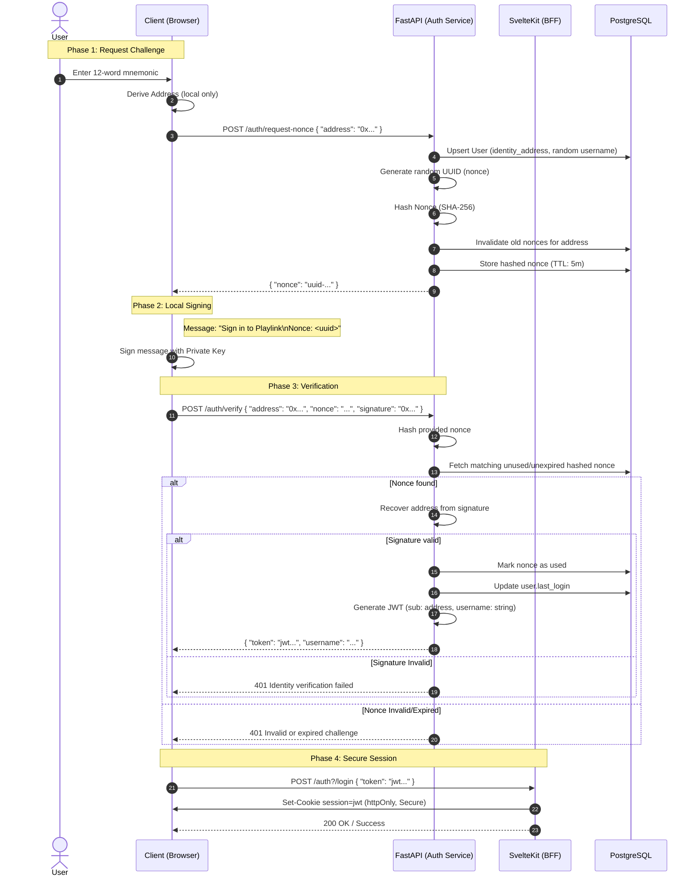

# Identity Authentication Flow

This document describes the challenge-response authentication mechanism used by Playlink.

## Sequence Diagram

## Key Security Features

### 1. Replay Protection
- Nonces are **one-time use** (`used` flag in DB).
- Requesting a new nonce **invalidates** all previous ones for that address.
- Nonces have a short **TTL** (default: 5 minutes).

### 2. Database Integrity
- The database only stores the **SHA-256 hash** of the nonce.
- This prevents "pre-signing" attacks if the database is compromised.

### 3. Non-Custodial
- The private key **never leaves the client**.
- The backend only verifies the proof of ownership.

### 4. XSS Protection (BFF Pattern)
- The JWT is stored in an **httpOnly cookie** by the SvelteKit server.
- This prevents malicious browser scripts from stealing the session token.

### 5. Identity Normalization
- All addresses are converted to **EIP-55 checksum format** before storage or lookup.
- Users are assigned a random persistent `username` upon first registration.
